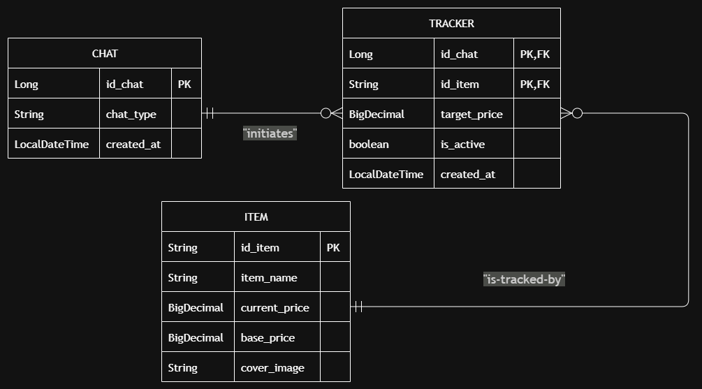

# PlayStation Tracker (PS-Tracker)


A Spring Boot backend service that polls PlayStation store prices, evaluates target thresholds and automates
alert notifications to specific chat sessions.

---

## About the Project
(todo)

---

## Built With
* **Language:** Java 21
* **Framework:** Spring Boot (Spring Data JPA, Validation, WebMVC, RestClient)
* **Database:** PostgreSQL 15
* **Persistence & ORM:** Hibernate ORM
* **Testing Infrastructure:** JUnit 5, Testcontainers, AssertJ, MockRestServiceServer
* **Containerization:** Docker & Docker Compose

---

## Database Design



### Structural Decisions:
* **Associative Entity Resolution:** The many-to-many (N:M) relationship between a Telegram `Chat` and a game `Edition`
is resolved via the `Tracker` entity. This prevents hidden join tables and allows the relationship itself to hold 
business logic (e.g., specific `target_price` thresholds).
* **Composite Primary Keys:** A user should only be able to track a specific edition once. This uniqueness is guaranteed 
at the database level using a composite key (`id_chat`, `id_edition`) implemented via JPA's `@EmbeddedId` and mapped 
cleanly using `@MapsId`.
* **Financial Precision:** Floating-point math is notoriously dangerous for currency. All monetary values are strictly 
mapped to PostgreSQL's `numeric(5,2)` via Java's `BigDecimal` to ensure absolute precision when triggering price drop alerts.
* **External ID Mapping:** Instead of relying on auto-generated sequences for users, the application directly 
assigns Telegram's native `chat_id` as the Primary Key. This removes the need for expensive lookup queries during 
webhook processing.

---

### Technical Improvements
* **Schema Evolution (Trade-off):** The project currently utilizes Hibernate's `ddl-auto=update` for rapid prototyping and
  seamless schema generation. While highly efficient for local development, this is not good practice because Hibernate might
  drop an existing column and create a new one, deleting user data when syncing the schema with the java entities. The
  database could be managed with a tool like to **Flyway** to enforce strict, version-controlled SQL migrations and prevent
  accidental data loss.

---

## External API Integration (Sony GraphQL)

### Structural Decisions:
* **Centralized HTTP Client (DRY):** All  requests to the PlayStation store are handled by the 
`SonyStoreClient` adapter. A private generic helper method (`<T> T fetchFromSony`) handles the `RestClient`
HTTP execution to avoid repeating code.
* **Flexible Deserialization:** The Sony GraphQL API returns massive, deeply nested JSON trees. 
The data is mapped into immutable Java `Record` DTOs. Using Jackson's 
`@JsonIgnoreProperties(ignoreUnknown = true)` ensures the application only deserializes the specific data paths it 
needs (like price and ID).
* **Security & CSRF Bypass:** Safely accesses Sony's undocumented API by mimicking a browser, explicitly encoding 
user inputs (to handle spaces/special characters) and enforcing required `apollo-require-preflight` HTTP headers.

---

## Project Structure
```text
francisco.ps.tracker
├── game/           # Core Domain: Game, Edition, Repositories
├── chat/           # Core Domain: Chat mappings and types
├── tracker/        # Core Domain: Associative Entity, composite keys, thresholds
├── infrastructure/ # External Adapters: Sony API integration (SonyStoreClient, DTO records)
```

---

## Tests
1. **Data Layer Integration (`TrackerRepositoryTest`):** Validates the composite keys, constraints, and persistence 
logic using `@DataJpaTest`. Uses **Testcontainers** to run against a real, temporary PostgreSQL Docker container rather
than an in-memory H2 mock, leveraging `TestEntityManager.flush()` to ensure SQL queries hit the disk.
2. **HTTP Adapter Integration (`SonyStoreClientTest`):** Isolates the HTTP client using `@RestClientTest` and
`MockRestServiceServer`. Proves the client securely builds expected URLs and successfully maps deeply nested JSON
trees into Java records. Avoids testing tautology by utilizing Hamcrest matchers (`containsString`) to verify 
URI encoding dynamically without duplicating massive GraphQL URL strings.

(todo)

---

## How to Run
(todo)
